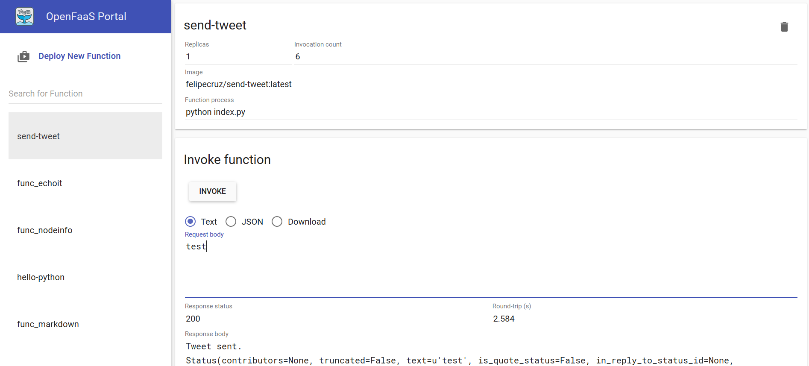

# Send tweet - OpenFaaS function

## Description

This is an OpenFaaS function written in Python that makes use of the `tweepy` library to send a tweet from your Twitter account. 



## Set up

1. You will need to specify your Twitter app environment variables in the `send-tweet.yml` file.

```environment:
  consumer_key: ""
  consumer_secret: ""
  access_token: ""
  access_token_secret: ""
  ```
  
If you do not have a Twitter App you can create one [here](https://apps.twitter.com).

2. In the same file, you must set the gateway IP which should be your Raspberry Pi IP address.

` gateway: http://<RASPBERRY_IP_ADDR>:8080`

## Build the function

`faas-cli build -f ./send-tweet.yml`

## Upload the function to a remote registry (optional)

 Note: before pushing to the Docker Hub, please go to the `send-tweet.yml` file and in the `image` property change the value from `send-tweet` to include your Docker Hub account - i.e. `felipecruz/send-tweet`

`faas-cli push -f ./send-tweet.yml`

## Deploy the function

`faas-cli deploy -f ./send-tweet.yml`
